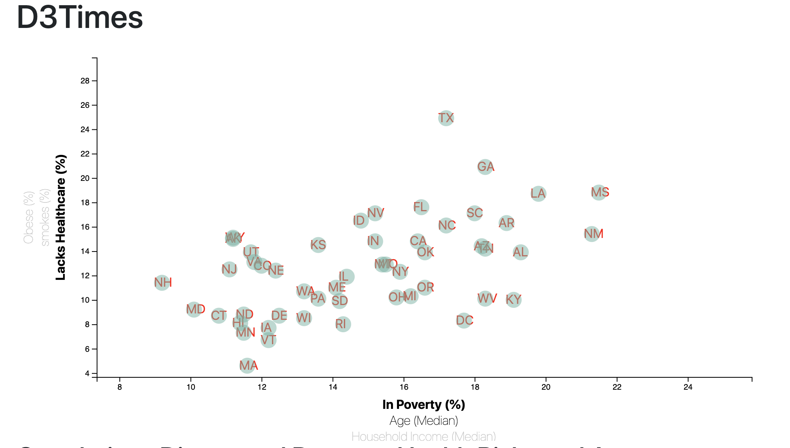

# data_journalism_and_d3

# Correlations Discovered Between Health Risks and Age, Income

* interactive scatter plot showing the correlation between healthcare problems (Lacks of healthcare, Obesity, Smokes) and different parameters (proverty, age, and income)
* choosing diiferent paramenter by clicking the labeled axis to investigate different combinations.
* each dot represents data collect from one state. 
* hoovering on the dot to show the details.